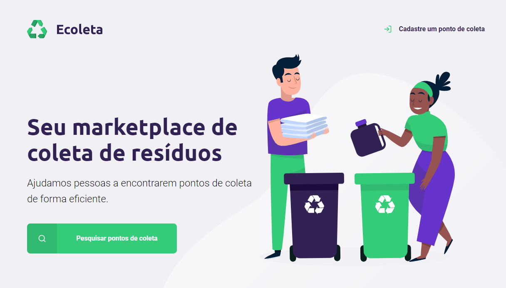
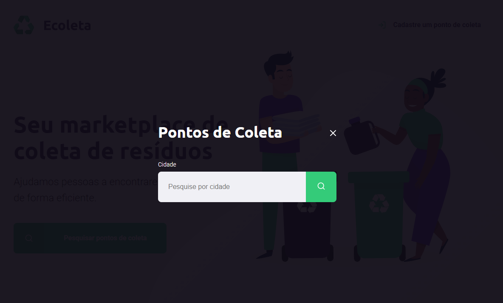
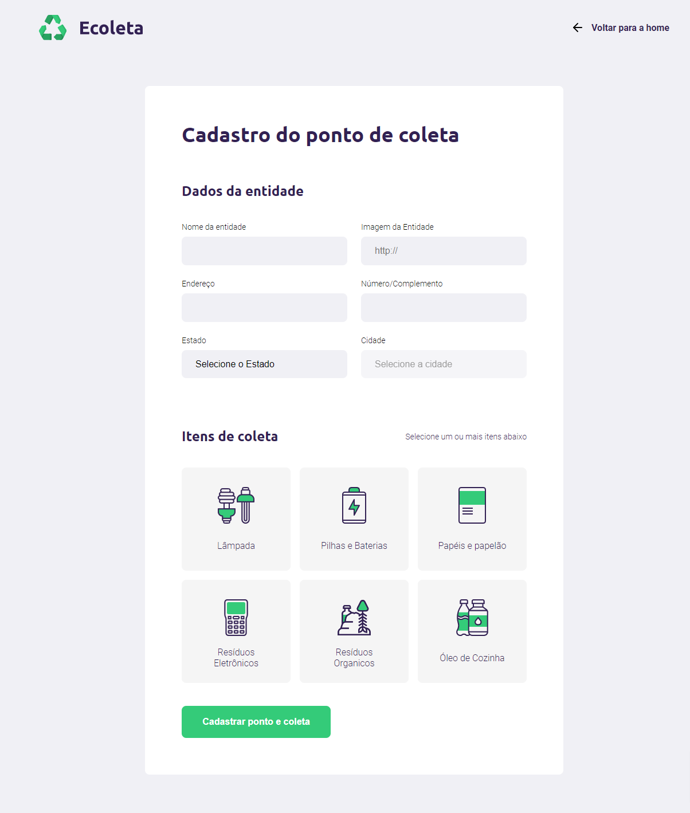
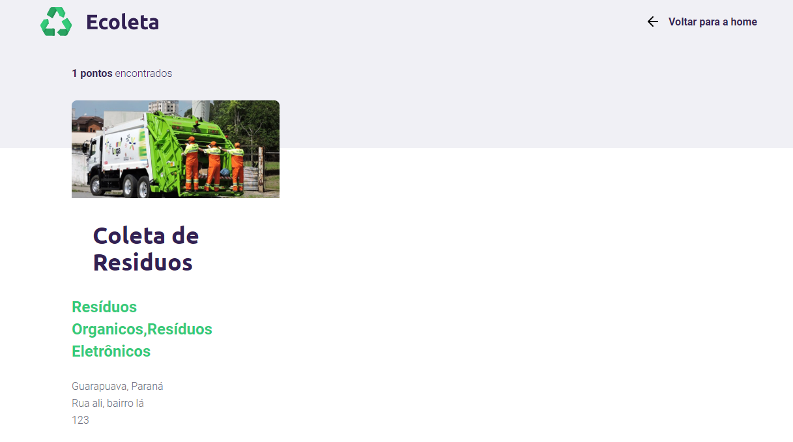

[](https://github.com/mat-zip/Ecoleta/issues) [](https://github.com/mat-zip/Ecoleta/network) [](https://github.com/mat-zip/Ecoleta/stargazers) [](https://github.com/mat-zip/Ecoleta)

<!-- PROJECT LOGO -->
<br />
<p align="center">
  <a href="https://github.com/othneildrew/Best-README-Template">
    
  </a>

  <h3 align="center">Seu marketplace de coleta de resíduos</h3>

  <p align="center">
    <a href="https://github.com/mat-zip/Ecoleta/tree/master/src"><strong>Explore o projeto »</strong></a>
  </p>
</p>

<!-- TABLE OF CONTENTS -->
<details open="open">
  <summary>Sumário</summary>
  <ol>
    <li>
      <a href="#sobre-o-projeto">Sobre o projeto</a>
      <ul>
        <li><a href="#built-with">Construído com</a></li>
      </ul>
    </li>
    <li>
      <a href="#getting-started">Getting Started</a>
      <ul>
        <li><a href="#pré-requisitos">Pré-requisitos</a></li>
        <li><a href="#instalação">Instalação</a></li>
      </ul>
    </li>
    <li><a href="#roadmap">Roadmap</a></li>
    <li><a href="#contribua">Contribua!</a></li>
    <li><a href="#licença">Licença</a></li>
    <li><a href="#contato">Contato</a></li>
  </ol>
</details>


<!-- ABOUT THE PROJECT -->
## Sobre o projeto
Marketplace para cadastro de centro de coleta de residuos






### Construído com
* [Javascript](https://www.javascript.com/)
* [SQLite3](https://www.sqlite.org/index.html)
* [Express](https://expressjs.com/pt-br/)
* [Nodemoon](https://nodemon.io/)
* [NunJucks](https://mozilla.github.io/nunjucks/)

<!-- GETTING STARTED -->
## Getting Started

Para ter uma cópia local e rodar o projeto siga os exemplos:

### Pré-requisitos

Você precisa ter o node.js instalado no seu computador

### Instalação

1. Clone o repositório
   ```sh
   git clone https://github.com/mat-zip/Ecoleta
   ```
2. Intalação dos pacotes e dependências
   ```sh
   npm install
   ```
3. Para iniciar o servidor local
    ```sh
    npm start
    ```

<!-- ROADMAP -->
## Roadmap
Consulte as [open issues](https://github.com/mat-zip/Ecoleta/issues) para obter uma lista de features propostas.

<!-- CONTRIBUTING -->
## Contribua!

As contribuições são o que tornam a comunidade de código aberto um lugar incrível para aprender, inspirar e criar. **Quaisquer contribuições que você fizer serão muito apreciadas**.

1. Faça um Fork do projeto
2. Crie a sua Feature Branch (`git checkout -b feature/AmazingFeature`)
3. Faça um Commit de suas mudanças (`git commit -m 'Add some AmazingFeature'`)
4. Faça um Push para a Branch (`git push origin feature/AmazingFeature`)
5. Abra uma pull request

<!-- CONTACT -->
## Contato

Matheus Rocha - [@matt_zip](https://twitter.com/matt_zip) - matheusc.2019@alunos.utfpr.edu.br

<!-- LICENSE -->
## Licença

Distribuído sob a licença MIT license. Veja `MIT-LICENSE.txt` para mais informações.

